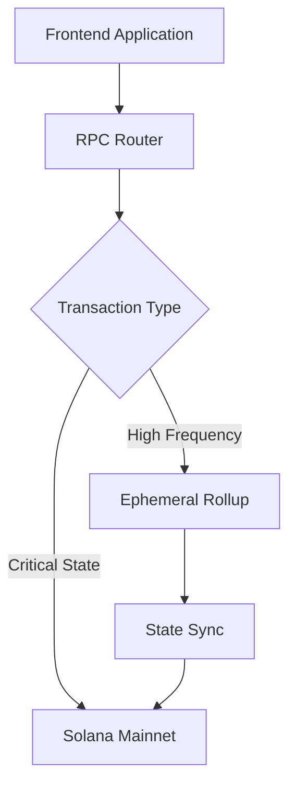
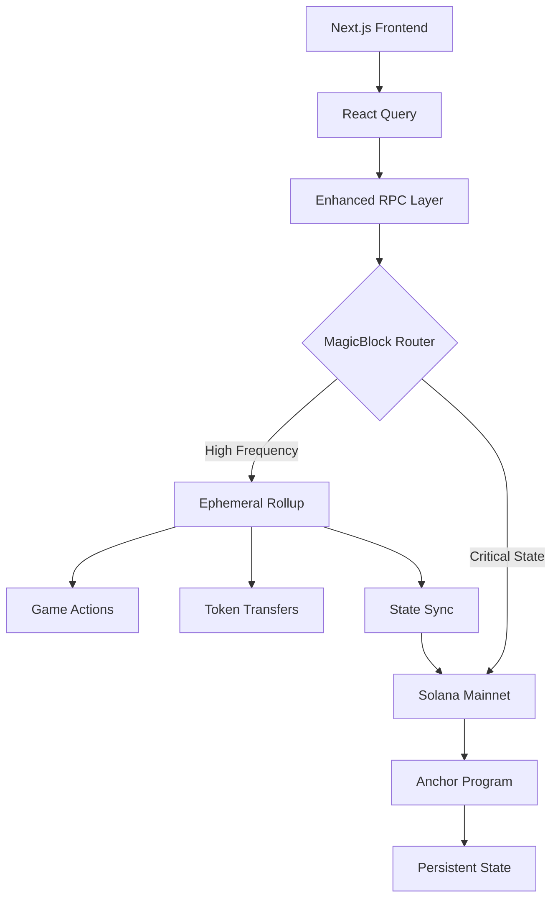

# Business Requirements Document (BRD)

## MagicBlock Rollup Integration for Solana Game Token Pool Application

**Document Version:** 1.0  
**Date:** August 4, 2025  
**Project Code:** 001-implement-magic-block-rollup  
**Classification:** Internal

---

## Table of Contents

1. [Executive Summary](#1-executive-summary)
2. [Project Overview](#2-project-overview)
3. [Business Objectives](#3-business-objectives)
4. [Stakeholder Analysis](#4-stakeholder-analysis)
5. [Scope Definition](#5-scope-definition)
6. [Current State Analysis](#6-current-state-analysis)
7. [Functional Requirements](#7-functional-requirements)
8. [Non-Functional Requirements](#8-non-functional-requirements)
9. [Technical Integration Requirements](#9-technical-integration-requirements)
10. [User Experience Requirements](#10-user-experience-requirements)
11. [Assumptions and Dependencies](#11-assumptions-and-dependencies)
12. [Constraints](#12-constraints)
13. [Risk Assessment](#13-risk-assessment)
14. [Success Metrics and KPIs](#14-success-metrics-and-kpis)
15. [Implementation Roadmap](#15-implementation-roadmap)
16. [Appendices](#16-appendices)

---

## 1. Executive Summary

### 1.1 Project Purpose

This document outlines the business requirements for integrating MagicBlock's ephemeral rollup technology into our existing Solana-based game token pool application. The integration aims to achieve ultra-low latency (10-50ms vs 400ms), support millions of transactions per second, and enable real-time gaming experiences while maintaining full Solana ecosystem compatibility.

### 1.2 Business Justification

Current Solana block times of 400ms create suboptimal user experiences for real-time gaming scenarios. MagicBlock's ephemeral rollups provide a solution that maintains Solana's security and composability while delivering performance improvements critical for competitive gaming applications.

### 1.3 Expected Benefits

- **Performance**: Reduce transaction latency from 400ms to 10-50ms
- **Throughput**: Scale to millions of TPS during peak gaming sessions
- **Cost Efficiency**: Enable gasless transactions for improved user experience
- **Competitive Advantage**: Position as a leading real-time blockchain gaming platform
- **User Experience**: Eliminate transaction confirmation delays during gameplay

### 1.4 Investment Required

- Development effort: 8-12 weeks
- Infrastructure costs: MagicBlock rollup provisioning fees
- Third-party integration costs: MagicBlock licensing/usage fees
- Testing and audit expenses: Security validation requirements

---

## 2. Project Overview

### 2.1 Background

Our Solana-based game token pool application currently processes token transfers, game session management, and user interactions through standard Solana transactions. While functional, the 400ms block times create noticeable delays that impact real-time gaming experiences.

### 2.2 Current Application Architecture

The application consists of:

- **Smart Contract Layer**: Anchor program with 11 core instructions
- **Frontend**: Next.js 15 application with TypeScript and React Query
- **State Management**: Jotai for local state, React Query for server state
- **Blockchain Integration**: @solana/web3.js and @coral-xyz/anchor

### 2.3 MagicBlock Technology Overview

MagicBlock's ephemeral rollups provide:

- Temporary, high-performance execution environments
- Full SVM (Solana Virtual Machine) compatibility
- Automatic scaling with horizontal rollup provisioning
- State synchronization between rollups and main chain
- No bridges or separate tokens required

### 2.4 Integration Strategy

The integration will implement a hybrid approach where:

- Critical state changes remain on Solana mainnet
- High-frequency game actions utilize ephemeral rollups
- Seamless transaction routing through MagicBlock's RPC router
- Existing Anchor program compatibility preserved

---

## 3. Business Objectives

### 3.1 Primary Objectives

1. **Performance Enhancement**
   - Achieve sub-50ms transaction latency for game actions
   - Support 1000+ concurrent users per game session
   - Enable real-time token transfers during gameplay

2. **User Experience Improvement**
   - Eliminate transaction confirmation waiting periods
   - Provide gasless transactions for core game actions
   - Maintain familiar web3 wallet integration patterns

3. **Scalability Achievement**
   - Support 10,000+ daily active users
   - Handle peak loads during gaming tournaments
   - Enable horizontal scaling for multiple concurrent games

### 3.2 Secondary Objectives

1. **Technical Excellence**
   - Maintain 99.9% system uptime
   - Preserve full Solana ecosystem composability
   - Implement comprehensive monitoring and observability

2. **Business Growth**
   - Increase user retention by 40%
   - Reduce transaction-related user complaints by 80%
   - Enable new revenue streams through premium low-latency features

---

## 4. Stakeholder Analysis

### 4.1 Primary Stakeholders

| Stakeholder      | Role              | Interest                               | Influence | Engagement Strategy               |
| ---------------- | ----------------- | -------------------------------------- | --------- | --------------------------------- |
| Development Team | Implementation    | Technical feasibility, maintainability | High      | Weekly technical reviews          |
| Product Manager  | Success metrics   | Feature delivery, user experience      | High      | Daily standups, milestone reviews |
| End Users        | Application usage | Performance, reliability               | Medium    | Beta testing, feedback collection |
| DevOps Team      | Infrastructure    | Deployment, monitoring                 | Medium    | Integration planning sessions     |

### 4.2 Secondary Stakeholders

| Stakeholder         | Role                | Interest               | Influence | Engagement Strategy          |
| ------------------- | ------------------- | ---------------------- | --------- | ---------------------------- |
| MagicBlock Team     | Technology provider | Successful integration | Medium    | Technical support channels   |
| Solana Foundation   | Ecosystem health    | Best practices         | Low       | Community engagement         |
| Security Auditors   | Risk assessment     | Code security          | Medium    | Audit planning and execution |
| Business Leadership | ROI realization     | Cost-benefit analysis  | High      | Monthly progress reports     |

---

## 5. Scope Definition

### 5.1 In Scope

#### 5.1.1 Core Integration Features

- MagicBlock RPC router integration
- Ephemeral rollup lifecycle management
- Automatic transaction routing logic
- State synchronization mechanisms

#### 5.1.2 Performance Enhancements

- Real-time token transfers between users
- Instant game session state updates
- Low-latency game joining/leaving operations
- High-frequency token movements during gameplay

#### 5.1.3 Infrastructure Components

- Rollup provisioning automation
- Health monitoring and alerting
- Fallback mechanisms to mainnet
- Performance metrics collection

#### 5.1.4 User Experience Improvements

- Gasless transaction options
- Real-time transaction confirmations
- Enhanced gaming session responsiveness
- Optimized mobile application performance

### 5.2 Out of Scope

#### 5.2.1 Excluded Features

- Complete migration to Layer 2 architecture
- Custom rollup implementation (using MagicBlock's solution)
- Mainnet program architecture changes
- Alternative scaling solutions (State Compression, etc.)

#### 5.2.2 Deferred Features

- Cross-rollup transaction support
- Advanced rollup customization features
- Multi-game rollup sharing
- Custom fee structure implementation

---

## 6. Current State Analysis

### 6.1 Performance Characteristics

#### 6.1.1 Transaction Latency

- **Current**: 400ms average block time
- **Peak periods**: Up to 1000ms during network congestion
- **Transaction confirmation**: "processed" level confirmation

#### 6.1.2 Throughput Limitations

- **Individual transfers**: Sequential processing required
- **Bulk operations**: Limited by RPC rate limits
- **Concurrent users**: Performance degradation beyond 100 simultaneous users

#### 6.1.3 Cost Structure

- **Base transaction fee**: ~0.000005 SOL
- **Priority fees**: Variable based on network congestion
- **Compute unit costs**: Program-specific computational requirements

### 6.2 Technical Architecture Assessment

#### 6.2.1 Strengths

- Robust Anchor program with comprehensive instruction set
- Well-structured frontend with modern React patterns
- Comprehensive error handling and user feedback systems
- Effective state management with React Query

#### 6.2.2 Performance Bottlenecks

- Transaction confirmation waiting periods
- RPC endpoint rate limiting
- Sequential transaction processing requirements
- Network congestion impact on user experience

#### 6.2.3 Integration Readiness

- Modular architecture supports rollup integration
- Existing RPC abstraction layer can accommodate routing
- State management system ready for real-time updates
- Component architecture supports performance enhancements

---

## 7. Functional Requirements

### 7.1 MagicBlock Integration Requirements

#### 7.1.1 RPC Router Integration

- **REQ-001**: System MUST integrate MagicBlock RPC router for automatic transaction routing
- **REQ-002**: System MUST maintain compatibility with existing @solana/web3.js calls
- **REQ-003**: System MUST provide configurable routing rules for different transaction types
- **REQ-004**: System MUST implement fallback to mainnet when rollups are unavailable

#### 7.1.2 Ephemeral Rollup Management

- **REQ-005**: System MUST automatically provision ephemeral rollups for game sessions
- **REQ-006**: System MUST manage rollup lifecycle (creation, scaling, termination)
- **REQ-007**: System MUST implement rollup health monitoring and recovery
- **REQ-008**: System MUST support multiple concurrent rollups for different games

#### 7.1.3 State Synchronization

- **REQ-009**: System MUST synchronize critical state changes to Solana mainnet
- **REQ-010**: System MUST maintain state consistency across rollup sessions
- **REQ-011**: System MUST implement conflict resolution for concurrent state changes
- **REQ-012**: System MUST provide state verification mechanisms

### 7.2 Performance Enhancement Requirements

#### 7.2.1 Transaction Processing

- **REQ-013**: Real-time token transfers MUST complete within 50ms
- **REQ-014**: Game state updates MUST propagate to all participants within 100ms
- **REQ-015**: System MUST support 1000+ transactions per second per rollup
- **REQ-016**: Bulk token operations MUST maintain sub-second completion times

#### 7.2.2 Gaming Operations

- **REQ-017**: Game joining/leaving MUST be instantaneous (<20ms)
- **REQ-018**: In-game token movements MUST not require user confirmation waiting
- **REQ-019**: Multi-user token transfers MUST execute atomically
- **REQ-020**: Game session state MUST remain consistent across all participants

### 7.3 User Experience Requirements

#### 7.3.1 Transaction Experience

- **REQ-021**: Users MUST receive immediate transaction confirmations
- **REQ-022**: System MUST provide gasless transaction options for core actions
- **REQ-023**: Failed transactions MUST provide clear error messages and recovery options
- **REQ-024**: Transaction history MUST include rollup and mainnet transaction details

#### 7.3.2 Gaming Experience

- **REQ-025**: Game interfaces MUST update in real-time without manual refresh
- **REQ-026**: Token balances MUST reflect changes immediately during gameplay
- **REQ-027**: Game session status MUST be visible to all participants instantly
- **REQ-028**: System MUST maintain game state during brief network interruptions

---

## 8. Non-Functional Requirements

### 8.1 Performance Requirements

#### 8.1.1 Latency Specifications

- **Transaction Latency**: 95th percentile < 50ms for rollup transactions
- **Game State Updates**: 99th percentile < 100ms propagation time
- **RPC Response Time**: Average < 20ms for rollup queries
- **Fallback Latency**: < 500ms when falling back to mainnet

#### 8.1.2 Throughput Specifications

- **Rollup TPS**: Support minimum 10,000 TPS per rollup instance
- **Concurrent Users**: Support 1,000 simultaneous users per game session
- **Batch Processing**: Handle 100+ token transfers in single atomic operation
- **Peak Load**: Maintain performance during 5x normal traffic spikes

### 8.2 Availability Requirements

#### 8.2.1 System Uptime

- **Target Availability**: 99.9% system uptime (8.76 hours downtime/year)
- **Planned Maintenance**: Maximum 2 hours monthly maintenance window
- **Recovery Time**: RTO (Recovery Time Objective) < 5 minutes
- **Data Loss**: RPO (Recovery Point Objective) < 1 minute

#### 8.2.2 Failover Capabilities

- **Automatic Failover**: Seamless fallback to mainnet within 30 seconds
- **Rollup Recovery**: Automatic rollup restart within 2 minutes
- **State Recovery**: Complete state restoration within 5 minutes
- **Service Degradation**: Graceful degradation during partial outages

### 8.3 Scalability Requirements

#### 8.3.1 Horizontal Scaling

- **Auto-scaling**: Automatic rollup provisioning based on demand
- **Load Distribution**: Intelligent load balancing across rollup instances
- **Resource Optimization**: Efficient resource utilization (>80% utilization)
- **Scaling Speed**: New rollup instances available within 60 seconds

#### 8.3.2 Growth Accommodation

- **User Growth**: Support 10x current user base without architecture changes
- **Transaction Growth**: Handle 100x current transaction volume
- **Feature Growth**: Accommodate new features without performance degradation
- **Geographic Growth**: Support global user distribution with low latency

### 8.4 Security Requirements

#### 8.4.1 Data Protection

- **State Security**: Maintain Solana-level security for critical state
- **Transaction Integrity**: Ensure transaction immutability and verifiability
- **Access Control**: Implement proper authentication and authorization
- **Audit Trail**: Comprehensive logging for all rollup operations

#### 8.4.2 Network Security

- **DDoS Protection**: Resist distributed denial of service attacks
- **Input Validation**: Validate all user inputs and transaction parameters
- **Rate Limiting**: Implement appropriate rate limiting mechanisms
- **Monitoring**: Real-time security monitoring and alerting

---

## 9. Technical Integration Requirements

### 9.1 Architecture Integration

#### 9.1.1 RPC Layer Integration



- **Integration Point**: Replace direct Solana RPC calls with MagicBlock router
- **Compatibility**: Maintain existing @solana/web3.js interface patterns
- **Configuration**: Environment-based routing rules configuration
- **Monitoring**: Comprehensive logging for routing decisions

#### 9.1.2 State Management Integration

- **Rollup State**: High-frequency game state and token movements
- **Mainnet State**: Critical account balances and game outcomes
- **Synchronization**: Periodic state commits to mainnet
- **Verification**: Cross-reference mechanisms for state consistency

### 9.2 Smart Contract Compatibility

#### 9.2.1 Anchor Program Compatibility

- **Instruction Compatibility**: All existing instructions MUST work unchanged
- **Account Structure**: Maintain current account structures and relationships
- **Program Deployment**: Support deployment to both mainnet and rollups
- **Version Management**: Coordinate program versions across environments

#### 9.2.2 Transaction Routing Logic

```typescript
interface TransactionRouting {
  routeToRollup: (instruction: TransactionInstruction) => boolean;
  getRollupEndpoint: (gameId: string) => string;
  getFallbackStrategy: () => 'mainnet' | 'queue' | 'reject';
}
```

### 9.3 Frontend Integration Requirements

#### 9.3.1 Connection Management

- **Multi-endpoint Support**: Manage connections to multiple rollup instances
- **Connection Pooling**: Efficient connection pooling and reuse
- **Health Checking**: Monitor endpoint health and availability
- **Automatic Switching**: Seamless switching between endpoints

#### 9.3.2 State Synchronization

- **Real-time Updates**: WebSocket connections for live state updates
- **Optimistic Updates**: Immediate UI updates with rollback capability
- **Conflict Resolution**: Handle state conflicts gracefully
- **Offline Support**: Queue transactions during connectivity issues

---

## 10. User Experience Requirements

### 10.1 Transaction Experience Enhancement

#### 10.1.1 Immediate Feedback

- **Instant Confirmations**: Visual confirmation within 100ms of transaction submission
- **Progress Indicators**: Real-time progress tracking for complex operations
- **Error Handling**: Clear, actionable error messages with recovery suggestions
- **Success Notifications**: Immediate success confirmations with transaction details

#### 10.1.2 Gasless Transaction Options

- **Core Actions**: Gasless token transfers during active game sessions
- **User Onboarding**: Gasless account creation and initial funding
- **Fallback Options**: Clear communication when gas fees are required
- **Cost Transparency**: Display when and why fees are necessary

### 10.2 Gaming Experience Enhancement

#### 10.2.1 Real-time Interactions

- **Live Updates**: Automatic UI updates without manual refresh
- **Collaborative Features**: Real-time multi-user interaction support
- **Conflict Resolution**: Handle simultaneous actions gracefully
- **State Consistency**: Ensure all users see consistent game state

#### 10.2.2 Performance Visibility

- **Performance Metrics**: Display connection quality and latency information
- **Network Status**: Visual indicators for rollup vs mainnet transactions
- **Debug Information**: Optional technical details for power users
- **Health Monitoring**: System status page for transparency

---

## 11. Assumptions and Dependencies

### 11.1 Technical Assumptions

#### 11.1.1 MagicBlock Platform Assumptions

- **Service Availability**: MagicBlock rollup infrastructure maintains 99.9% uptime
- **API Stability**: MagicBlock APIs remain stable during integration period
- **Performance Guarantees**: Advertised latency and throughput metrics are achievable
- **Documentation Quality**: Adequate technical documentation for integration

#### 11.1.2 Solana Network Assumptions

- **Network Stability**: Solana mainnet maintains current performance characteristics
- **RPC Availability**: Reliable access to Solana RPC endpoints
- **Program Compatibility**: Existing Anchor program continues to function correctly
- **Fee Structure**: Solana transaction fees remain within expected ranges

### 11.2 Business Assumptions

#### 11.2.1 User Adoption Assumptions

- **User Acceptance**: Users will adopt improved performance features
- **Learning Curve**: Minimal user education required for new features
- **Performance Expectations**: Users will notice and value latency improvements
- **Feature Usage**: High-frequency gaming features will see significant usage

#### 11.2.2 Market Assumptions

- **Competitive Landscape**: Performance advantages provide competitive differentiation
- **Technology Maturity**: MagicBlock technology is production-ready
- **Regulatory Environment**: No regulatory changes affecting rollup technology
- **Economic Conditions**: Continued investment in blockchain gaming sector

### 11.3 External Dependencies

#### 11.3.1 MagicBlock Dependencies

- **Platform Access**: Timely access to MagicBlock developer resources
- **Technical Support**: Responsive technical support during integration
- **Feature Availability**: Required features available in MagicBlock platform
- **Pricing Model**: Acceptable pricing for rollup usage and provisioning

#### 11.3.2 Infrastructure Dependencies

- **Cloud Providers**: Reliable cloud infrastructure for hosting components
- **Network Connectivity**: High-quality network connections for low latency
- **Monitoring Tools**: Adequate monitoring and observability solutions
- **Security Services**: Access to security scanning and audit services

---

## 12. Constraints

### 12.1 Technical Constraints

#### 12.1.1 Compatibility Constraints

- **Solana Compatibility**: Must maintain full Solana ecosystem compatibility
- **Anchor Framework**: Must preserve existing Anchor program functionality
- **Web3 Standards**: Must adhere to standard web3 wallet integration patterns
- **Browser Support**: Must support all major modern browsers

#### 12.1.2 Performance Constraints

- **Rollup Limitations**: Subject to MagicBlock platform limitations
- **Network Dependencies**: Performance dependent on network quality
- **Resource Constraints**: Limited by available computational resources
- **Scaling Boundaries**: Bound by MagicBlock's horizontal scaling capabilities

### 12.2 Business Constraints

#### 12.2.1 Budget Constraints

- **Development Budget**: Limited development resources for implementation
- **Operational Costs**: Ongoing costs for MagicBlock platform usage
- **Infrastructure Costs**: Additional infrastructure requirements
- **Third-party Costs**: Costs for security audits and testing

#### 12.2.2 Timeline Constraints

- **Market Deadlines**: Pressure to deliver competitive features quickly
- **Resource Availability**: Limited developer availability during implementation
- **Testing Requirements**: Adequate time needed for comprehensive testing
- **Audit Requirements**: Security audit timeline requirements

### 12.3 Regulatory Constraints

#### 12.3.1 Compliance Requirements

- **Data Protection**: Compliance with applicable data protection regulations
- **Financial Regulations**: Adherence to financial services regulations where applicable
- **Gaming Regulations**: Compliance with gaming and gambling regulations
- **Cross-border**: International data transfer and service provision compliance

---

## 13. Risk Assessment

### 13.1 Technical Risks

#### 13.1.1 High-Impact Technical Risks

| Risk                                     | Probability | Impact | Mitigation Strategy                                                  | Owner     |
| ---------------------------------------- | ----------- | ------ | -------------------------------------------------------------------- | --------- |
| MagicBlock platform instability          | Medium      | High   | Implement robust fallback mechanisms, maintain mainnet compatibility | Dev Team  |
| Integration complexity exceeds estimates | High        | Medium | Phased implementation approach, prototype validation                 | Tech Lead |
| Performance targets not achieved         | Medium      | High   | Early performance testing, alternative optimization strategies       | Dev Team  |
| State synchronization failures           | Low         | High   | Comprehensive testing, automated verification systems                | Dev Team  |

#### 13.1.2 Medium-Impact Technical Risks

| Risk                                | Probability | Impact | Mitigation Strategy                                 | Owner         |
| ----------------------------------- | ----------- | ------ | --------------------------------------------------- | ------------- |
| Third-party dependency issues       | Medium      | Medium | Vendor management, alternative solutions evaluation | DevOps        |
| Security vulnerabilities introduced | Low         | High   | Security code reviews, penetration testing          | Security Team |
| Rollup provisioning delays          | Medium      | Medium | Pre-provisioning strategies, capacity planning      | DevOps        |
| Browser compatibility issues        | Low         | Medium | Comprehensive cross-browser testing                 | QA Team       |

### 13.2 Business Risks

#### 13.2.1 Market and Competition Risks

| Risk                                         | Probability | Impact | Mitigation Strategy                                    | Owner    |
| -------------------------------------------- | ----------- | ------ | ------------------------------------------------------ | -------- |
| Competitor implements similar solution first | Medium      | Medium | Accelerated development timeline, unique feature focus | Product  |
| User adoption lower than expected            | Medium      | Medium | User research, gradual rollout, feedback incorporation | Product  |
| MagicBlock pricing increases                 | Low         | Medium | Contract negotiations, cost-benefit analysis           | Business |
| Regulatory changes affect rollup usage       | Low         | High   | Legal consultation, compliance monitoring              | Legal    |

### 13.3 Operational Risks

#### 13.3.1 Implementation and Deployment Risks

| Risk                                  | Probability | Impact | Mitigation Strategy                             | Owner    |
| ------------------------------------- | ----------- | ------ | ----------------------------------------------- | -------- |
| Deployment failures                   | Medium      | Medium | Staged deployment, rollback procedures          | DevOps   |
| Insufficient testing coverage         | Medium      | High   | Comprehensive test planning, automated testing  | QA Team  |
| Performance degradation in production | Medium      | High   | Load testing, performance monitoring            | Dev Team |
| User training and support challenges  | High        | Low    | Documentation, user guides, support preparation | Support  |

### 13.4 Risk Monitoring and Response

#### 13.4.1 Risk Monitoring Framework

- **Weekly Risk Reviews**: Assessment of all identified risks
- **Performance Monitoring**: Continuous monitoring of key performance indicators
- **User Feedback**: Regular collection and analysis of user feedback
- **Vendor Communication**: Regular check-ins with MagicBlock team

#### 13.4.2 Escalation Procedures

- **Technical Issues**: Immediate escalation to technical lead and MagicBlock support
- **Performance Issues**: Alert system for performance threshold breaches
- **Security Issues**: Immediate escalation to security team and management
- **Business Issues**: Regular communication with stakeholders and management

---

## 14. Success Metrics and KPIs

### 14.1 Performance Metrics

#### 14.1.1 Latency Improvements

- **Baseline**: Current 400ms average transaction time
- **Target**: 95th percentile < 50ms for rollup transactions
- **Measurement**: Automated latency monitoring with 1-minute granularity
- **Success Criteria**: Consistent achievement of sub-50ms for 95% of transactions

#### 14.1.2 Throughput Enhancements

- **Baseline**: Current throughput limitations during peak usage
- **Target**: Support 1000+ concurrent users per game session
- **Measurement**: Real-time user concurrency monitoring
- **Success Criteria**: No performance degradation up to 1000 concurrent users

### 14.2 User Experience Metrics

#### 14.2.1 User Satisfaction

- **User Retention**: Target 40% improvement in monthly active users
- **Session Duration**: Target 25% increase in average session length
- **Transaction Completion**: Target 95% transaction success rate
- **User Complaints**: Target 80% reduction in performance-related support tickets

#### 14.2.2 Engagement Metrics

- **Feature Adoption**: Target 60% of users utilizing rollup-enhanced features
- **Transaction Frequency**: Target 2x increase in transactions per user session
- **Real-time Features**: Target 80% usage rate for real-time gaming features
- **Mobile Performance**: Target equivalent performance metrics on mobile devices

### 14.3 Technical Excellence Metrics

#### 14.3.1 System Reliability

- **Uptime**: Target 99.9% system availability
- **Error Rate**: Target <0.1% transaction error rate
- **Recovery Time**: Target <5 minutes for system recovery
- **Fallback Success**: Target 100% successful fallback to mainnet when needed

#### 14.3.2 Operational Efficiency

- **Deployment Success**: Target 100% successful deployments
- **Monitoring Coverage**: Target 100% coverage of critical system components
- **Alert Response**: Target <15 minutes mean time to acknowledge alerts
- **Cost Efficiency**: Target 20% reduction in per-transaction costs

### 14.4 Business Impact Metrics

#### 14.4.1 Revenue and Growth

- **User Growth**: Target 100% increase in daily active users within 6 months
- **Revenue Impact**: Target 30% increase in revenue from improved user experience
- **Market Position**: Achieve recognition as leading real-time blockchain gaming platform
- **Competitive Advantage**: Maintain performance advantage over competitors

#### 14.4.2 Cost-Benefit Analysis

- **Development ROI**: Achieve positive ROI within 12 months
- **Operational Savings**: Target 25% reduction in infrastructure costs per transaction
- **Support Efficiency**: Target 50% reduction in performance-related support costs
- **Time to Market**: Deliver competitive advantage within 3 months of completion

---

## 15. Implementation Roadmap

### 15.1 Phase 1: Foundation and Planning (Weeks 1-2)

#### 15.1.1 Technical Preparation

- **Week 1**:
  - MagicBlock platform access and credentials setup
  - Development environment configuration
  - Technical architecture review and validation
  - Risk assessment and mitigation planning

- **Week 2**:
  - Prototype development for RPC router integration
  - Performance baseline establishment
  - Testing framework setup and validation
  - Security review of integration approach

#### 15.1.2 Deliverables

- Technical integration plan
- Development environment setup
- Prototype demonstration
- Baseline performance metrics

### 15.2 Phase 2: Core Integration (Weeks 3-6)

#### 15.2.1 RPC Router Implementation

- **Week 3**:
  - RPC router integration development
  - Transaction routing logic implementation
  - Fallback mechanism development
  - Initial unit testing

- **Week 4**:
  - Ephemeral rollup provisioning automation
  - State synchronization mechanism implementation
  - Error handling and recovery procedures
  - Integration testing with test rollups

#### 15.2.2 Smart Contract Compatibility

- **Week 5**:
  - Anchor program compatibility validation
  - Multi-environment deployment testing
  - Transaction routing rule configuration
  - Performance optimization implementation

- **Week 6**:
  - State management integration
  - Real-time update mechanisms
  - Comprehensive integration testing
  - Performance benchmarking

#### 15.2.3 Deliverables

- Functional RPC router integration
- Rollup provisioning automation
- State synchronization system
- Integration test results

### 15.3 Phase 3: Frontend Enhancement (Weeks 7-8)

#### 15.3.1 User Interface Updates

- **Week 7**:
  - Real-time transaction feedback implementation
  - Performance indicator integration
  - Error handling and user messaging
  - Mobile optimization and testing

- **Week 8**:
  - Gasless transaction flow implementation
  - Gaming experience enhancements
  - User experience testing and refinement
  - Cross-browser compatibility validation

#### 15.3.2 Deliverables

- Enhanced user interface with real-time features
- Gasless transaction implementation
- Mobile optimization completion
- Cross-browser compatibility validation

### 15.4 Phase 4: Testing and Optimization (Weeks 9-10)

#### 15.4.1 Comprehensive Testing

- **Week 9**:
  - Load testing and performance validation
  - Security testing and vulnerability assessment
  - End-to-end testing with real user scenarios
  - Stress testing under peak load conditions

- **Week 10**:
  - Performance optimization based on test results
  - Bug fixes and stability improvements
  - Documentation completion
  - Deployment preparation

#### 15.4.2 Deliverables

- Complete test results and performance validation
- Optimized system performance
- Security assessment report
- Deployment-ready system

### 15.5 Phase 5: Deployment and Monitoring (Weeks 11-12)

#### 15.5.1 Production Deployment

- **Week 11**:
  - Staged production deployment
  - Monitoring and alerting system activation
  - User communication and training materials
  - Support team preparation

- **Week 12**:
  - Full production rollout
  - Performance monitoring and optimization
  - User feedback collection and analysis
  - Success metrics tracking initiation

#### 15.5.2 Deliverables

- Production system fully deployed
- Monitoring and alerting operational
- User documentation and training materials
- Success metrics tracking dashboard

---

## 16. Appendices

### 16.1 Appendix A: Technical Architecture Diagrams

#### 16.1.1 Current System Architecture

```mermaid
graph TB
    A[Next.js Frontend] --> B[React Query]
    B --> C[@solana/web3.js]
    C --> D[Solana RPC]
    D --> E[Anchor Program]
    E --> F[Token Accounts]
    E --> G[Game State]
    E --> H[User Data]
```

#### 16.1.2 Proposed Architecture with MagicBlock



### 16.2 Appendix B: MagicBlock Integration Specifications

#### 16.2.1 Supported Transaction Types for Rollup Routing

- `transfer_token_between_users` - High frequency, low latency required
- `user_transfer_token_to_game` - Real-time gaming action
- `take_token_from_game` - Real-time gaming action
- `user_join_game` - Instant joining required
- `user_quit_game` - Instant leaving required

#### 16.2.2 Mainnet-Only Transaction Types

- `init_pool` - Critical infrastructure setup
- `add_user_to_pool` - Account creation and initial funding
- `deposit` - External fund deposits
- `init_game` - Game creation and setup
- `user_end_game` - Final game state commitment

### 16.3 Appendix C: Performance Benchmarking Framework

#### 16.3.1 Latency Measurement Points

```typescript
interface PerformanceMeasurement {
  transactionSubmission: number; // Time of transaction submission
  rollupConfirmation: number; // Time of rollup confirmation
  mainnetSync: number; // Time of mainnet synchronization
  uiUpdate: number; // Time of UI state update
}
```

#### 16.3.2 Throughput Testing Scenarios

- **Scenario 1**: 1000 concurrent users performing token transfers
- **Scenario 2**: 10 simultaneous games with 100 players each
- **Scenario 3**: Peak load simulation with 5x normal traffic
- **Scenario 4**: Bulk transfer operations with 100+ recipients

### 16.4 Appendix D: Security Considerations

#### 16.4.1 State Security Model

- **Rollup State**: Temporary, high-frequency updates
- **Mainnet State**: Authoritative, permanent record
- **Synchronization**: Periodic commits with verification
- **Rollback**: Ability to revert to last known good state

#### 16.4.2 Attack Vector Analysis

- **MEV (Maximal Extractable Value)**: Mitigation through rollup isolation
- **Front-running**: Protection through transaction ordering mechanisms
- **State manipulation**: Prevention through cryptographic verification
- **Denial of Service**: Rate limiting and resource management

### 16.5 Appendix E: Cost-Benefit Analysis

#### 16.5.1 Implementation Costs

- **Development**: 480 hours @ $150/hour = $72,000
- **MagicBlock Platform**: $2,000/month operational costs
- **Infrastructure**: $1,000/month additional cloud costs
- **Security Audit**: $15,000 one-time cost
- **Total First Year**: $108,000

#### 16.5.2 Expected Benefits

- **User Retention**: 40% improvement = $50,000 annual value
- **Transaction Volume**: 2x increase = $75,000 annual value
- **Operational Efficiency**: 25% cost reduction = $20,000 annual savings
- **Competitive Advantage**: Market position value = $100,000
- **Total Annual Benefits**: $245,000

#### 16.5.3 ROI Calculation

- **Net Benefit Year 1**: $245,000 - $108,000 = $137,000
- **ROI**: 127% return on investment in first year
- **Payback Period**: 5.3 months

---

**Document Control:**

- **Author**: Product Management Team
- **Reviewers**: Development Team, DevOps Team, Security Team
- **Approval**: CTO, Product Director
- **Next Review Date**: September 4, 2025
- **Version History**: 1.0 - Initial version (August 4, 2025)
